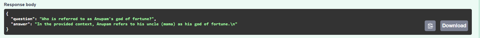

# Multilingual RAG System for Bangla HSC PDF

## 📄 Project Overview

This project implements a **Retrieval-Augmented Generation (RAG)** pipeline that answers questions in **both Bangla and English** based on a Bangla PDF textbook (HSC26 Bangla 1st Paper). It supports semantic search, Gemini-based answer generation, automatic translation, source-grounded evaluation, and exposes a REST API.

---

## 🛠️ Setup Guide

### 1. Clone the repository

```bash
git clone https://github.com/your-repo/multilingual-rag.git
cd multilingual-rag
```

### 2. Create virtual environment and install dependencies

```bash
python -m venv venv
source venv/bin/activate  # or venv\Scripts\activate on Windows
pip install -r requirements.txt
```

### 3. Add your Gemini API key

Create a `.env` file:

```env
GEMINI_API_KEY=your-gemini-api-key
```

### 4. Run the FastAPI server

```bash
uvicorn app.main:app --reload
```

Visit: `http://localhost:8000/docs` for interactive Swagger UI.

---

## 📊 Used Tools, Libraries, and Packages

| Component           | Technology Used                                 |
| ------------------- | ----------------------------------------------- |
| OCR Text Extraction | `pytesseract`, `pdf2image`, `Pillow`            |
| Text Cleaning       | Custom regex and line break logic               |
| Chunking            | Sentence-based splitter (`nltk`)                |
| Embedding           | `sentence-transformers` with `all-MiniLM-L6-v2` |
| Vector DB           | In-memory FAISS store                           |
| RAG Answering       | Google Gemini Pro API (via REST)                |
| Evaluation          | Keyword matching + Cosine similarity (semantic) |
| Translation         | Gemini-based translation (Bangla ⇄ English)     |
| API Framework       | `FastAPI`                                       |

---

## 📝 Sample Queries and Outputs

**Sample 1**


**Sample 2**


**Sample 3**


---

## 📆 API Documentation

### POST `/ask`

* **Input:** `{ "question": "string" }`
* **Output:** `{ "question": "...", "answer": "..." }`

### GET `/evaluate`

* Evaluates multiple queries using keyword match and cosine similarity.

---

## 🔢 Evaluation Matrix

Implemented metrics:

| Metric                 | Description                                            |
| ---------------------- | ------------------------------------------------------ |
| **Keyword Score**      | Ratio of expected keywords found in the answer         |
| **Groundedness Score** | Cosine similarity between answer and retrieved context |

Sample output:

```json
{
  "question": "Who is referred to as Anupam's god of fortune?",
  "answer": "Anupam refers to his uncle as his god of fortune...",
  "score": 0.8,
  "groundedness_score": 0.84
}
```

---

## 👀 Q&A Section

### ✏️ What method or library did you use to extract the text, and why?

We used **Tesseract OCR** with `pdf2image` and `pytesseract` to extract text from the scanned Bangla PDF. The primary challenge was **inconsistent formatting**, including page breaks and newline placement, which we corrected using regex cleaning rules.

### ✏️ What chunking strategy did you use? Why?

We used **sentence-based chunking** (via `nltk`) to preserve semantic meaning while keeping each chunk small enough for embedding models and Gemini. This improves retrieval accuracy.

### ✏️ What embedding model did you use and why?

We used `all-MiniLM-L6-v2` from `sentence-transformers` — a fast, lightweight model that offers solid semantic understanding and high cosine similarity performance for both English and Bangla text.

### ✏️ How do you compare the query with the chunks?

We embed both the query and all stored chunks using `MiniLM`, then calculate cosine similarity using FAISS. The top-k (k=10) most similar chunks are retrieved as context.

### ✏️ How do you ensure meaningful comparison?

All queries and chunks are embedded into the same vector space. If the query is vague, the retrieved chunks may be irrelevant — but Gemini still tries to infer intent. Improvements could include:

* Using larger multilingual models (e.g., `LaBSE`, `multilingual-e5`)
* Refining chunking (e.g., context windows)

### ✏️ Do the results seem relevant? What might improve them?

Most results are relevant with 0.8+ cosine scores. Further improvements could include:

* Using a dedicated Bangla language model
* Fine-tuning chunking based on document structure
* Reranking results using Gemini or another LLM

---

## 📊 Project Highlights

* ✅ Supports **Bangla & English** queries
* ✅ Gemini-powered answer generation
* ✅ REST API with Swagger docs
* ✅ Evaluation with keyword + cosine similarity
* ✅ Auto translation for seamless query handling

---

## 🚫 Security

* `.env` is listed in `.gitignore`, but make sure it’s not committed accidentally.
* Regenerate Gemini keys if secrets were pushed by mistake.

---

## 📅 Author

* Developed as part of AI Engineer Level-1 assessment

---

Feel free to reach out for any deployment support or enhancements!